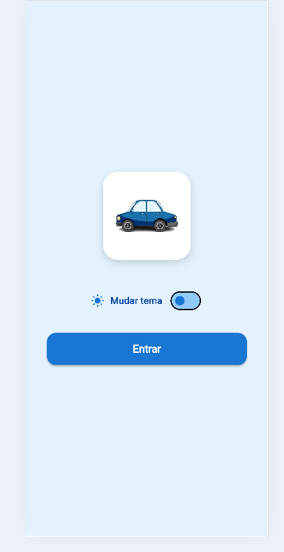
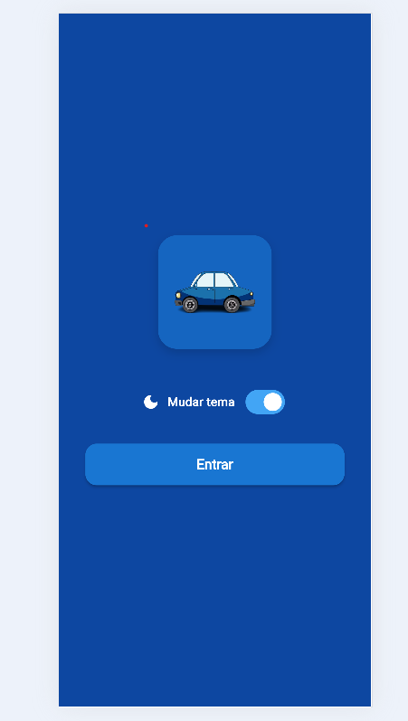
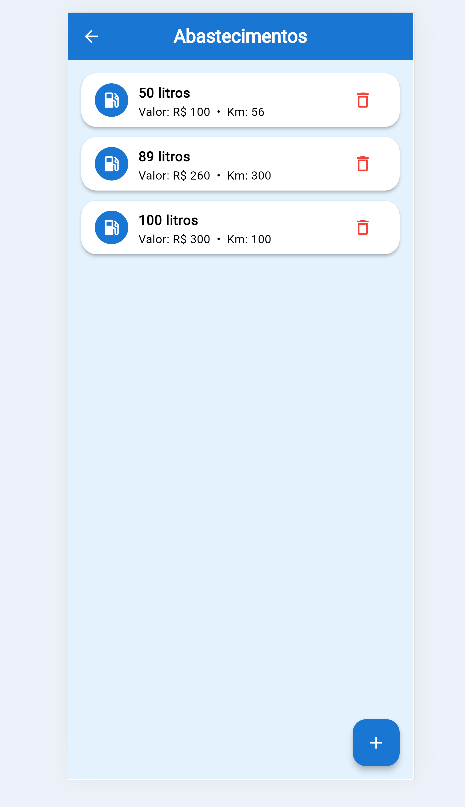
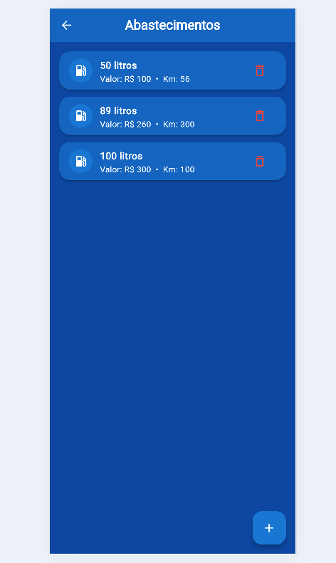
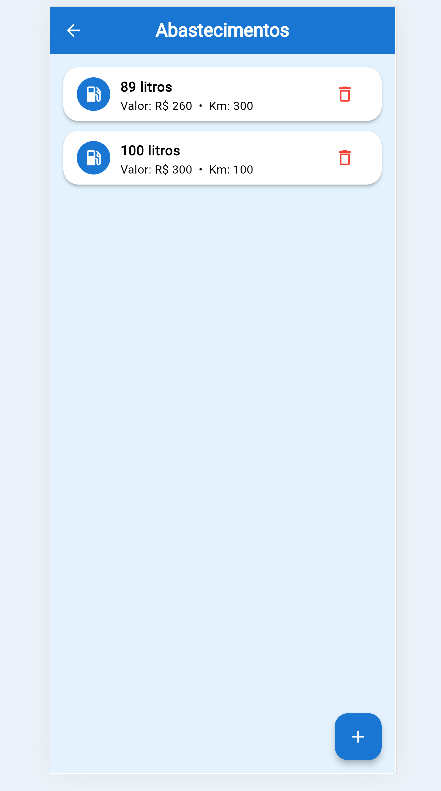

# Aplicativo Veículos

## Objetivo do Trabalho

O aplicativo **Veículos** foi desenvolvido com o objetivo de permitir que o usuário registre e acompanhe informações relacionadas aos abastecimentos de seus veículos de forma simples e organizada.

O sistema permite cadastrar informações sobre os abastecimentos, facilitando o controle dos registros e mantendo os dados armazenados localmente no dispositivo.

O aplicativo também possui armazenamento local dos dados e permite a utilização dos temas claro e escuro.

---

## Tecnologias Utilizadas

- Flutter
- Dart
- SharedPreferences
- Path Provider
- Armazenamento local
- Material Design

---

## Funcionamento do Aplicativo

O aplicativo possui três principais funcionalidades:

### Tela Inicial

A tela inicial apresenta:

- Ícone do aplicativo;
- Nome do aplicativo;
- Opção para **Mudar Tema**;
- Botão **Entrar**.

O usuário pode escolher entre o **tema claro** e o **tema escuro**.

### Tela Principal

Na tela principal, o usuário pode:

- Adicionar um abastecimento;
- Visualizar os abastecimentos cadastrados;
- Excluir um abastecimento;
- Consultar os registros armazenados;
- Manter os dados salvos localmente.

### Cadastro de Abastecimento

Para cadastrar um abastecimento, o usuário informa os dados solicitados pelo aplicativo.

Após o cadastro, as informações são exibidas na lista de registros da tela principal.

Os registros podem ser excluídos quando necessário.

---

## Armazenamento Local

Os dados cadastrados são armazenados localmente no dispositivo utilizando **Path Provider** e **SharedPreferences**.

O **Path Provider** é utilizado para acessar um diretório apropriado do dispositivo para o armazenamento dos dados.

O **SharedPreferences** é utilizado para manter informações e preferências do aplicativo, como a escolha do tema.

Dessa forma, as informações permanecem disponíveis mesmo após fechar e abrir novamente o aplicativo.

---

## Temas

O aplicativo possui dois temas:

### Tema Claro

Interface com cores claras, proporcionando uma visualização simples e agradável.

### Tema Escuro

Interface adaptada para utilização em ambientes com pouca iluminação.

O usuário pode alternar entre os dois temas através da opção **Mudar Tema** na tela inicial.

---

# Prints do Aplicativo

## Tela Inicial — Tema Claro

---

## Tela Inicial — Tema Escuro

---

## Tela Principal — Tema Claro

---

## Tela Principal — Tema Escuro

---

## Apaguei um Item — Tema Claro

---

## Apaguei um Item — Tema Escuro

---
